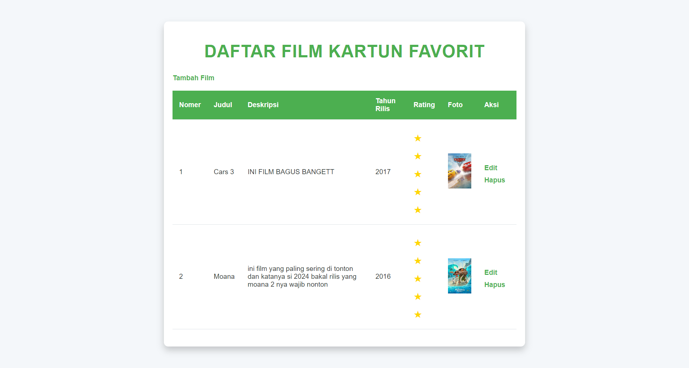

# Daftar Film Kartun Favorit 🎬
Proyek ini adalah sebuah aplikasi web sederhana yang memungkinkan pengguna untuk melihat, menambah, mengedit, dan menghapus daftar film kartun favorit mereka. Website ini dibangun menggunakan HTML, CSS, PHP, dan MySQL.

## Fitur Utama
- Menampilkan Daftar Film: Menampilkan daftar film kartun favorit lengkap dengan judul, deskripsi, tahun rilis, rating, dan foto poster film.
- Tambah Film: Pengguna dapat menambah film baru dengan mengisi judul, deskripsi, tahun rilis, rating, dan mengunggah foto poster film.
- Edit dan Hapus: Tersedia fitur untuk mengedit informasi film yang sudah ada atau menghapusnya dari daftar.
- CRUD dengan PHP & MySQL: Data film disimpan dalam database MySQL dan dikelola menggunakan PHP untuk proses Create, Read, Update, dan Delete (CRUD).
- Desain Responsif: Menggunakan CSS untuk memastikan tampilan yang responsif di berbagai perangkat.

## Teknologi yang Digunakan
- HTML & CSS: Untuk struktur dan tampilan halaman web.
- PHP: Untuk backend dan pengelolaan data.
- MySQL: Sebagai database untuk menyimpan data film.

## Cara Menjalankan Proyek
- Clone repository ini.
Pastikan server lokal seperti XAMPP atau Laragon sudah terpasang.
- Buat database MySQL baru dengan nama ```film_favorit```.
- Import file ```database.sql``` ke dalam database MySQL.
- Letakkan folder proyek di dalam folder ```htdocs``` (untuk XAMPP).
- Jalankan server lokal dan akses website melalui ```localhost/nama_folder_proyek.```



## Ucapan Terima Kasih 🙏
Terima kasih telah mengunjungi dan menggunakan aplikasi web "Daftar Film Kartun Favorit" ini! 💚 Proyek ini dibuat sebagai sarana belajar dan berbagi kesenangan tentang film-film kartun yang kita semua cintai. Semoga aplikasi ini bermanfaat dan dapat menjadi referensi bagi teman-teman yang ingin mempelajari dasar-dasar HTML, CSS, PHP, dan MySQL.

Saya juga ingin mengucapkan terima kasih kepada semua yang telah memberikan dukungan, saran, dan kritik yang membangun. Jika ada ide, masukan, atau bahkan bug yang ditemukan, jangan ragu untuk membuka issue atau mengirimkan pull request.

Happy coding dan semoga hari kalian menyenangkan! 😊